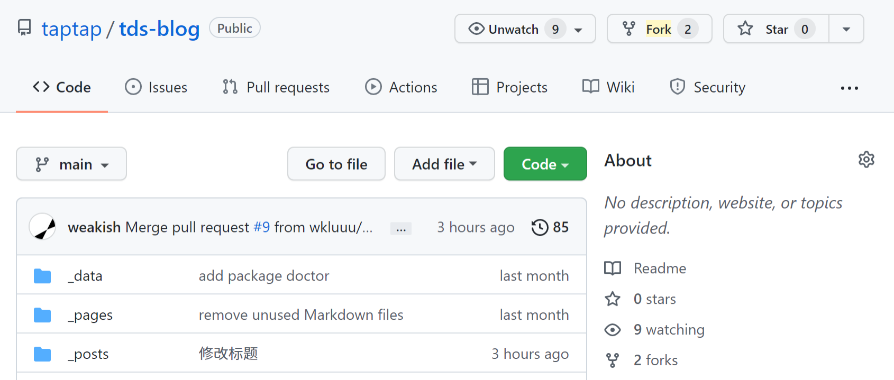
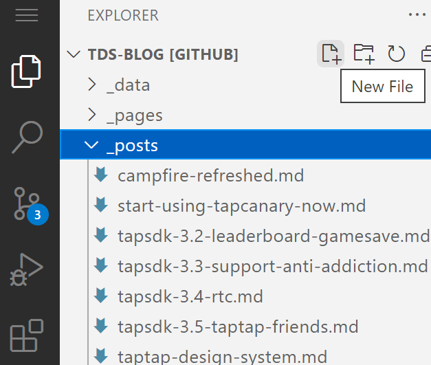
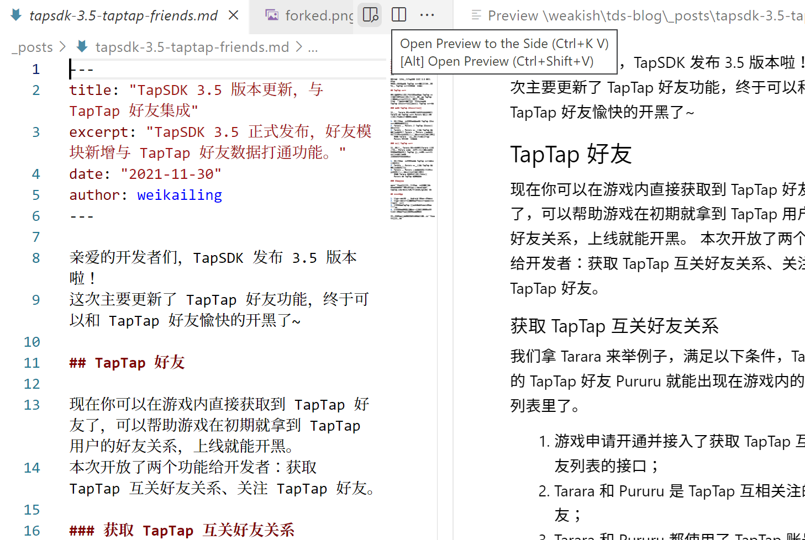
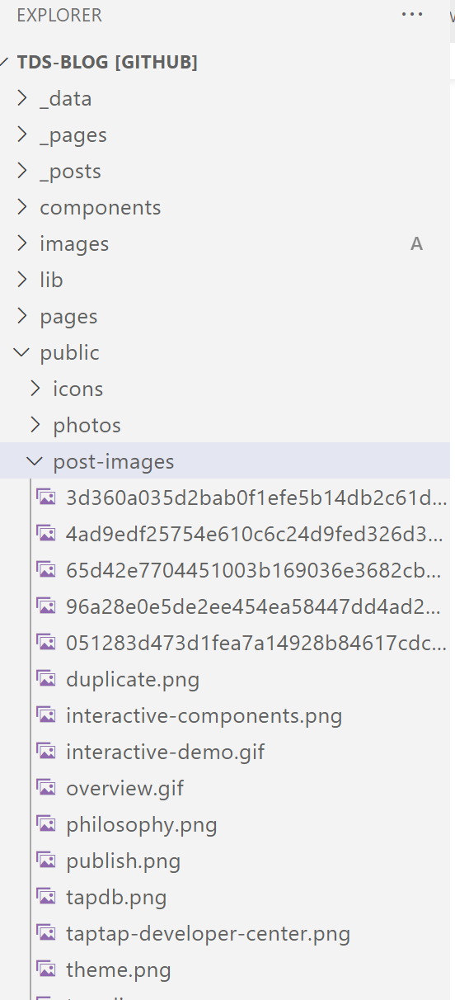
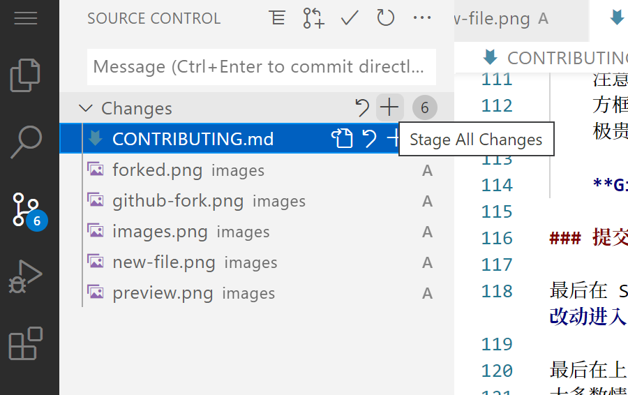
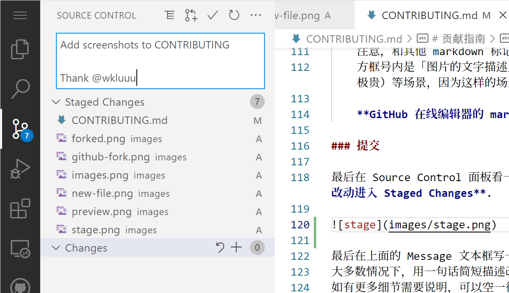
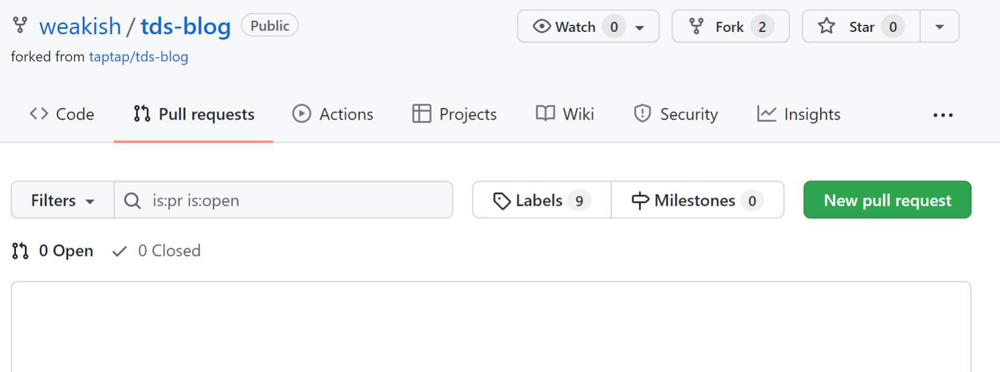
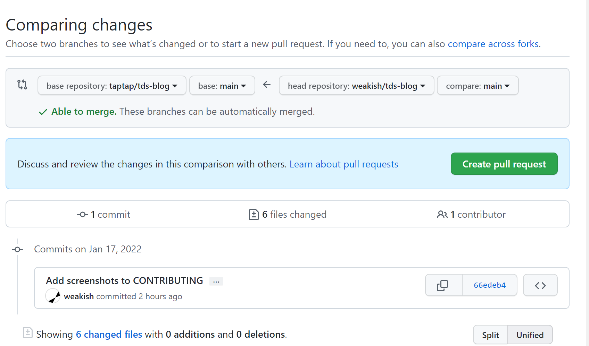
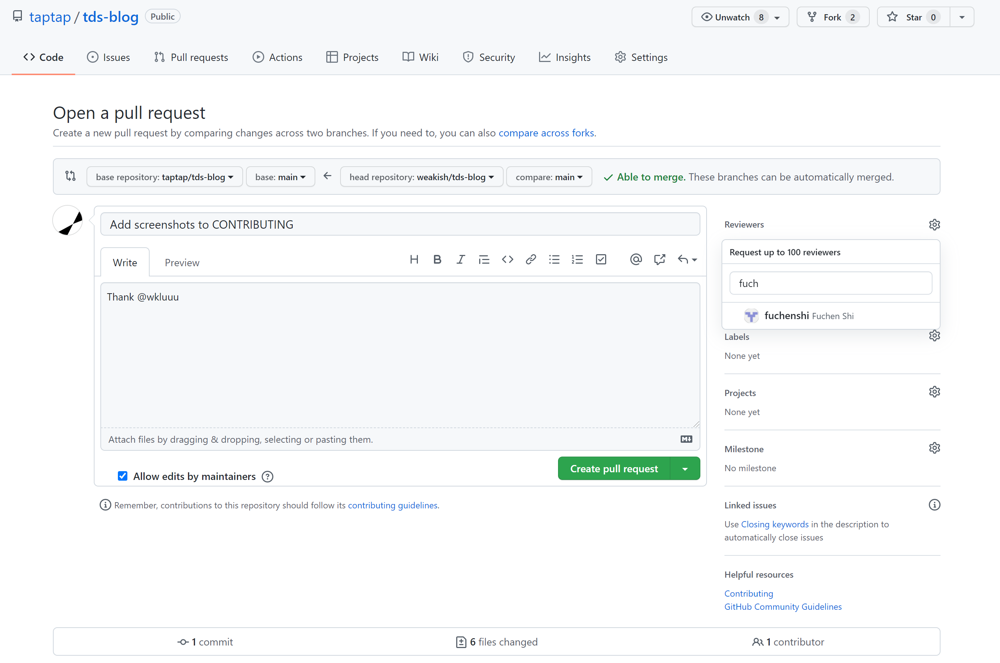
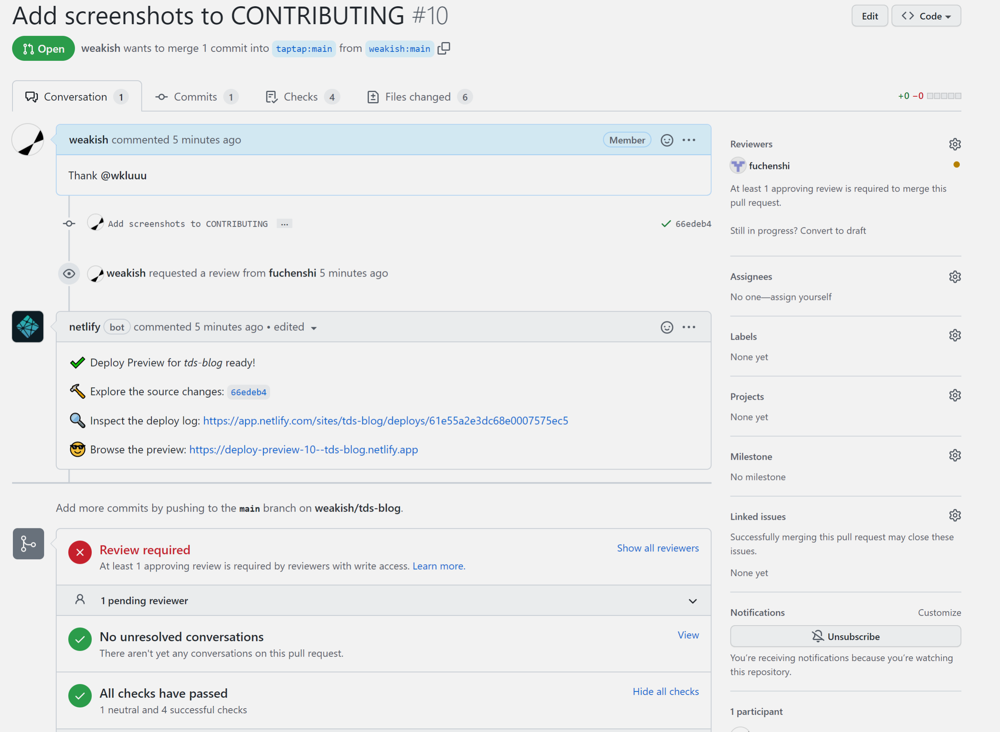

# 贡献指南

## 文案风格

请先阅读[文案风格指南][style]，确保贡献的内容符合文案风格。
其中的一些文案风格可能不符合很多人平时的行文习惯，比如：

- 直角引号
- 中文、英文、数字混合时的空格
- 「你」和「您」

敬请特别留意。

[style]: https://blog.taptap.dev/pages/chinese-copywriting-guide

## 文本格式

所有博客文章都在 `_posts` 路径下： https://github.com/taptap/tds-blog/tree/main/_posts

所有博客文章用到的图片放在 `public/post-images` 下： https://github.com/taptap/tds-blog/tree/main/public/post-images

博客文章使用 [markdown] 语法，文章开头的 front matter 通过 [YAML] 指定文章的元数据（标题、发布日期、摘要等）。
文件名会成为 URL 的一部分，因此请使用小写英文字母、数字、连字符（`-`），例如 `taptap-design-system.md`。

[markdown]: https://www.markdown-cheatsheet.com
[YAML]: https://quickref.me/yaml

下面是一个例子：

```markdown
---
title: "标题"
excerpt: "摘要"
date: "YYYY-MM-DD"
author: "作者"
---

markdown 内容
```

如有 markdown 无法表达的内容，可以使用 HTML。

如果你了解 markdown 和 github 协作的一般流程，那么现在就可以开始给 TDS 博客贡献内容了。
期待你的第一个 [PR]！

[PR]: https://docs.github.com/en/get-started/quickstart/github-flow

如果你不了解这些，也没关系，可以继续阅读下面的指南。

## GitHub 在线编辑博客

### 编辑

在[博客的 GitHub 仓库页面][repo]点击右上角的「Fork」图标，fork 本仓库。



如果之前没有 fork 过，会 fork 一个新仓库；如果之前已经 fork 过，会提示你的 fork 的地址：


**在你 fork 的仓库页面**， 按下 `.` （英文句号），即可进入 GitHub 的编辑模式。

[repo]: https://github.com/taptap/tds-blog/

取决于操作系统和浏览器配置，这个快捷键也可能失效。
如果快捷键不起效，可以把浏览器地址栏的 `github.com` 换成 `github.dev`，通过这种方式同样可以进入编辑模式。

这个 GitHub 编辑模式其实是一个功能精（shòu）简（xiàn）的 vscode 编辑器，所以它的用法可以参考 [vscode 的官方文档](https://code.visualstudio.com/docs)。

最左侧由上往下的图标依次是菜单、文件、查找、源码控制等功能。

1. 点击「文件」图标，在左栏点击 `_posts` 旁的箭头可展开文件夹，之后在鼠标悬浮到 EXPLORER 右侧的 `...` 的下方，会出现四个图标，点击最左侧的「New File」文件即可新增文件。

    
    
2. 文件名会成为 URL 的一部分，因此请使用小写英文字母、数字、连字符（`-`），例如 `taptap-design-system.md`，发布后的 URL 是 https://blog.taptap.dev/posts/taptap-design-system

3. markdown 文件开头是 [YAML] front matter，指定博客文章的元信息，注意 YAML 区域上下分别用三个短横 `---` 隔开，其中用到的短横、冒号、引号都是英文半角标点，`YYYY-MM-DD`是文章发布的日期，比如 `1970-01-01`。

    ```markdown
    ---
    title: "这里写文章标题"
    excerpt: "这里写一句话摘要。摘要会显示在首页。"
    date: "YYYY-MM-DD"
    author: "作者，可以写你的名字或昵称"
    ---

    markdown 内容
    ```


4. 右上角有三个图标，最左侧的图标可以分栏显示预览，可以实时预览 markdown 的渲染效果（仅供参考，部分格式预览效果不一定准确）

    

5. 如果需要添加图片，依次点击 public -> post-images 左侧的箭头，展开文件夹后，直接把图片拖过去即可上传。

    - 图片的命名也请使用小写英文字母、数字、连字符（`-`），**不要包含空格**（URL 中空格需要转义，如果文件名包含空格，后续 markdown 里引用图片的时候还要转义空格，比较麻烦，而且万一忘了转义图片就无法显示。图片文件名不用空格就可以避免这些烦心事）。
    - 图片不要和已有的图片重名，除非你想更新现有的图片。

    
    

6. 上传图片后，在 markdown 文件中通过以下 markdown 语法引用图片：

        

    注意，和其他 markdown 标记一样，这里的符号 ![] /  都是英文半角符号。
    方框号内是「图片的文字描述」，用于盲人、在浏览器中选择不加载图片（网速极慢或流量极贵）等场景，因为这样的场景比较罕见，所以也可以偷懒不填。

### 提交

最后在 Source Control 面板看一下变动情况，没问题的话就**点击 Changes 右侧的加号，让改动进入 Staged Changes**.



最后在上面的 Message 文本框写一下 Commit Message，简单说明下做了什么改动。
大多数情况下，用一句话简短描述改动内容即可。
如有更多细节需要说明，可以空一行写详情。

```
简短描述

可选的详情
```

按 Ctrl/Command + Enter 即可提交。



提交后访问 https://github.com/YOUR-GITHUB-USERNAME/tds-blog/pulls （请替换 URL 中的用户名）



在 Pull Requests 页面点击右上方绿色的 New pull request 按钮，会显示你所做的改动。



大致看一下有没有问题，如果有问题的话，就关闭页面，重新回到 https://github.com/YOUR-GITHUB-USERNAME/tds-blog/ 按 `.` 进入编辑模式再修改。

没问题的话，点绿色的 Create pull request 按钮进入 PR 表单。
PR 标题 GitHub 会自动填写，如果不满意，可以修改一下。
右方 Reviewer 选择 weakish 或 fuchenshi，然后再点绿色的 Create pull request 按钮提交。



提交后 CI 会自动构建博客预览，请稍候。
预览构建完成后，机器人 netlify bot 的回复中会出现「😎 Browse the preview: 」，点击后面的 URL 即可查看效果。
不同于 GitHub 编辑模式自动的预览，这个是真正的预览，未来发布后，线上显示的效果和预览一模一样，包括各种格式和图片。



上图中，「All checks have passed」标明预览构建成功。
红色的「Review required」是表示 reviewer 还没有 approve，属正常现象，不是构建错误，不必惊慌。

如果查看预览的过程中发现了问题，请重新回到 https://github.com/YOUR-GITHUB-USERNAME/tds-blog/ 按 `.` 进入编辑模式再修改。
提交修改（Source Control 面板按 Ctrl/Command + Enter）后，PR 会自动更新，也会自动再次触发预览构建，请再次等待机器人 netlify bot 的回复中出现「😎 Browse the preview: 」,再次查看预览效果。

一切就绪后，等 reviewer 通过 PR 并合并，文章就正式发布到线上了。
正式发布之后，再进入编辑模式修改就不会自动更新 PR 了（因为相关 PR 已经合并了），需要开新的 PR.

## Tips

Confluence wiki、Notion 等网页上的富文本内容，可以复制到 [Mark Text]（开源，推荐使用）、[Typora]（收费）、[StackEdit] （开源，可以在浏览器中直接使用，但对一些复杂格式的支持不如 Mark Text 和 Typora 全）可以快速转换为 markdown 代码。
注意，部分格式转换时会丢失或错误，需要手工修正。

[Mark Text]: https://marktext.app
[StackEdit]: https://stackedit.io/app
[Typora]: https://typora.io

命令行工具 [pandoc] 支持转换多种文件为 markdown，同样，部分格式转换时会丢失或错误，需要手工修正。

[pandoc]: https://pandoc.org/index.html